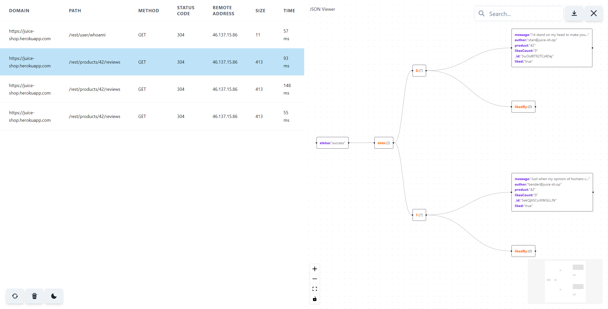

# Grapho - Chrome DevTools Extension

Grapho is a Chrome extension that enhances your web development experience by providing a comprehensive overview of HTTP calls made by a web page in the Chrome Developer Tools. It offers a convenient way to visualize and interact with JSON-formatted HTTP responses, helping developers analyze network activity and troubleshoot issues efficiently.

## Preview

## Features

- **Tab in Chrome DevTools**: Grapho adds a new tab in the Chrome Developer Tools interface, allowing easy access to HTTP call information.
- **Table View**: Displays HTTP calls made by the page in a table format, including domain, path, timing, method, and other relevant data.
- **JSON Response Filtering**: Only displays HTTP calls with JSON-formatted responses, making it easier to focus on relevant data.
- **Interactive Graph View**: Upon clicking an HTTP call in the table, a second column opens with an interactive graph displaying the JSON tree structure.
- **Live Search**: Enables live searching within the graph, allowing users to quickly find specific elements.
- **Minimap**: Provides a minimap within the graph view to visualize the entire JSON tree structure and navigate efficiently.
- **Export as SVG**: Provides the option to save the entire graph as an SVG file for further analysis or documentation purposes.
- **Clear History**: Allows users to clear the history of HTTP calls for better organization and troubleshooting.
- **Reload Page**: Offers the functionality to reload the page directly from the extension interface.
- **Theme Customization**: Users can change the theme of the extension interface to suit their preferences.

## Installation

1. Clone or download the Grapho repository.
2. Open Chrome and navigate to `chrome://extensions/`.
3. Enable Developer mode.
4. Click on "Load unpacked" and select the directory where you cloned/downloaded Grapho.
5. Grapho should now appear in your list of installed extensions.

## Usage

1. Open the Developer Tools in Chrome (Ctrl + Shift + I or Cmd + Option + I).
2. Navigate to the Grapho tab.
3. Explore the table view to see HTTP call details.
4. Click on a specific call to view its JSON tree in the graph view.
5. Utilize live search to find specific elements within the graph.
6. Use the minimap to navigate and understand the overall structure of the JSON tree.
7. Export the graph as an SVG for further analysis or documentation.
8. Clear history, reload the page, or customize the theme as needed.

## Contributions

Contributions to Grapho are welcome! Feel free to open issues for feature requests or bug reports, and submit pull requests to contribute enhancements or fixes.

## License

This project is licensed under the MIT License.

## Acknowledgments

Grapho was inspired by the need for a tool to visualize HTTP calls and JSON responses in a developer-friendly manner. Special thanks to the creators of ReactFlow for providing the graph visualization library.
